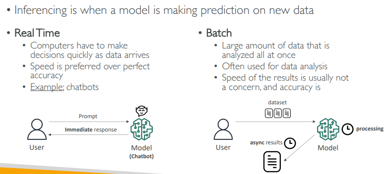
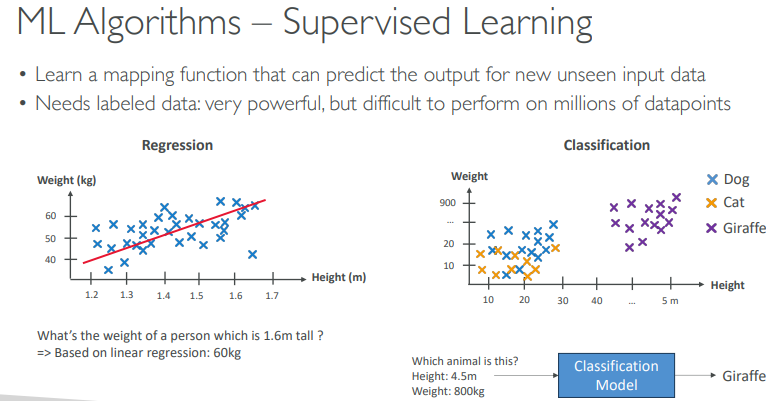
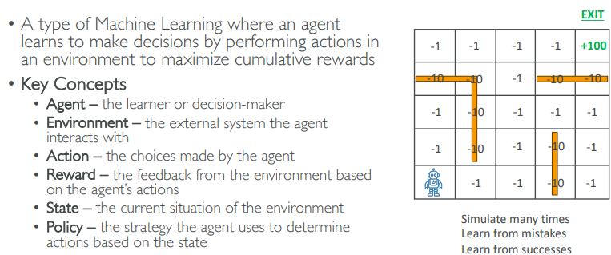
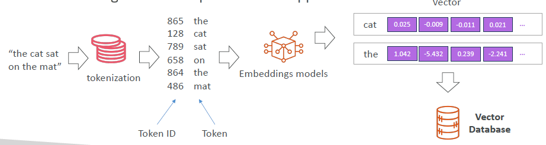
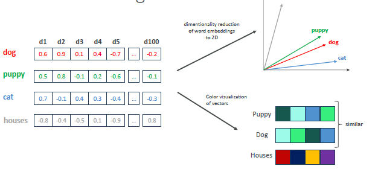
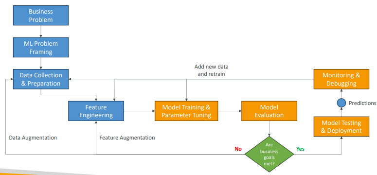

## A. ML Model developed
### IDP (Intelligent document processing)
### NLP (ML model)
- text classification
- sentiment analysis
- machine translation 
- language generation.

### Computer vision (ML model)
- makes it possible for computers to interpret and understand digital images and videos.
- image classification
- object detection
- image segmentation

### Wavenet model
- model to generate raw audio waveform, used in Speech Synthesis

### KNN Model
- model use for classification  in supervised learning
- eg: learn pattern and figure out spam email.

### GAN
- (Generative Adversarial Network) 
- models used to generate **synthetic data** 
- such as images, videos or sounds that resemble the training data. 
- Helpful for data augmentation

### traditional DL Model
- collect > prep > label > train > model-1 (**static**)
- collect > prep > label > train > model-2 (static)
- ...
- collect > prep > label > train > FM (humungous) > adapt to perform multiple task (**dynamic**) ⬅️
    - How ? here we go **FM** comes 

---
### FM ⬅️
- models that are pretrained on **internet-scale data** --> FM
- Multi-purpose models backed by neural network/s
- FMs can also serve as the starting point for developing more **specialized models**
- **Specialized AI datacenters**
    - requires massive compute, typically across thousands of GPUs over weeks/months. NVIDIA A100  H100.
    - supercomputers with 10,000–25,000 GPUs, interconnected by high-speed NVLink
    - Training data is stored in fast, distributed SSD/NVMe storage. Needs hundreds of TBs to petabytes.
    - Infiniband : 400 Gbps
  
--- 
## B. Intro :: genAI
- **Inference** is the process of using  FM to make predictions or generate **new** outputs
- AWS : run Small Language Model (SLM) on the edge device
- genAI generates new data/content (ext, images, audio, code, or video) that is similar to the **data it was trained on**.
- rely on DL model and ML model 
- 

---
## C. genAI Models
### LLM (BERT, GPT, etc)
- large language model.
- eg: google **BERT**, ChatGPT (generative Pretrained **Transformer**)
- BERT are similar to GPY but read in both direction.
- transformer Model : helps to process by sentence, not by word

| **Aspect**        | **Foundation Model**                                                                     | **LLM (Large Language Model)**                                                        |
| ----------------- | ---------------------------------------------------------------------------------------- | ------------------------------------------------------------------------------------- |
| **Definition**    | A large, general-purpose model trained on diverse data that can be adapted to many tasks | A type of foundation model specialized in understanding and generating human language |
| **Domain**        | Multimodal: text, images, audio, video, code, etc.                                       | Primarily text (some LLMs now include code & basic image understanding)               |
| **Use Cases**     | Chatbots, image generation, code generation, audio transcription, robotics               | Text generation, summarization, translation, Q\&A                                     |
| **Training Data** | Diverse: images, video, text, code, audio, etc.                                          | Mostly large-scale text and code                                                      |

- **Large Language Models** (LLMs):
  - AI model trained on massive amounts of text to understand
  - and generate human-like language.
  - Can answer questions, summarize, translate, write code, and more.
  - tokens (words/phrase) + embedding(number for token) + vector(define relaton b/w words/token)
- **Diffusion Model**s / GANs:
  - Used for generating images and videos.

### Multimodal models
- input/output = text or images
- text --> image
- image --> text
- text --> graphics
- ...

### Diffusion models (DL model)
- **forward diffusion** : the system gradually introduces a small amount of noise to an input image until only the noise is left over.
- **Reverse diffusion** :the noisy image is gradually introduced to denoising until a new image is generated

### Other generative models
- GANs 
- VAEs (inspired from Diffusion model)

---
## D. FM :: life cycle ✅
```
⭕ pre-training
- Data collect : website, book, etc
- Data prep : struture/unstructure(image,etc) + labels, map() + unlabel(input), inheritance pattern, relationship
- Data train with ML alog == 🔺initial pre-training
⭕ Data evaluation

⭕ MODEL ready ✅

⭕ host on cloud (eg: bedrock::amz titan,nova)
use it (inference) - batch + realtime

⭕ 🔺optimized / Customization  / Continious pre-training 
- prompt engineering
- Use adapters / LoRA layers
- retrieval-augmented generation (RAG)
- transfer learning(new layer) |  🔺fine tune (some layer) |  re-train (all layer)::rare/$$

 >> evaluate again  ( metrics and benchmarks)
  Training vs. Validation vs. Test Set

⭕ Deploy FM :: 
- base(already hosted)
- add delta-layer at runtime, Bedrock will take care.

⭕ use it : Make API call to cutom/tuned

⭕ Monitoring & Feedback
-  the model's performance is continuously monitored
- feedback is collected from users, domain experts, or other stakeholders
```

## E. FM :: optimize ways

  | Method                | What It Does                                                | When to Use                                           |
    | --------------------- | ----------------------------------------------------------- | ----------------------------------------------------- |
  | **Retraining**        | Train all layers from scratch (no pre-learned knowledge)    | You have a **huge dataset** and want **full control** |
  | **Transfer Learning** | Reuse early layers, train only the last layer               | You have **limited data** and want to save time       |
  | **Fine-Tuning**       | Start from a pre-trained model and train some or all layers | You want to **adapt** a model to your domain          |

### E.1 Fine-tuning
### E.2 Transfer learning

```
Transfer Learning
✅ Use Layer 1-3 (pretrained) ➡️ 🔒 Freeze them
🆕 Add new Layer 4 for your task ➡️ 🟢 Train only this

---
Fine-Tuning
✅ Use Layer 1-3 ➡️ 🔓 Unfreeze some (e.g., Layer 3)
🆕 Add Layer 4 ➡️ 🟢 Train both new and selected old layers

---
Think of it this way 🧠
    Retraining = Teach a student everything from zero 📖
    Transfer learning = Student already knows basics, you teach just the last chapter 📘
    Fine-tuning = Student knows a lot, but you adjust what they’ve learned to your topic ✏️
```

### E.3 Re-training

| Aspect                   | Fine-Tuning                                                                             | Retraining                                                                    |
| ------------------------ | --------------------------------------------------------------------------------------- | ----------------------------------------------------------------------------- |
| **Definition**           | Start with a pre-trained model and train it further on a smaller, task-specific dataset | Train a model from scratch or large dataset, often from random initialization |
| **Data Size**            | Usually small, task/domain-specific dataset                                             | Large dataset covering broad/general knowledge or new data                    |
| **Compute Cost**         | Lower, fewer epochs, updates only part/all weights                                      | Higher, requires full training from scratch                                   |
| **Time**                 | Faster to complete                                                                      | Time-consuming, longer training cycles                                        |
| **Use Case**             | Customize a model for specific task/domain                                              | Build a new model or significantly update with fresh data                     |
| **Model Starting Point** | Uses weights from an existing pre-trained model                                         | Starts with random or previous checkpoint (sometimes old model)               |
| **Flexibility**          | Good for domain adaptation or task-specific tweaks                                      | Suitable for major updates or completely new models                           |
| **Performance**          | Often better with limited data, leverages learned knowledge                             | Can be better if you have massive new data and resources                      |


### E.4 Prompt Engineering
- **Prompts** --> instructions for FM, foundation models, to enhance the output as per business/our needs
- prompt Engineering : developing, designing, and optimizing prompts

### E.5 RAG + embedded Model
- [udemy demo 1](https://www.udemy.com/course/aws-ai-practitioner-certified/learn/lecture/44886393#overview) - custom model created, pdf loaded in S3, etc
- [udemy demo 2](https://www.udemy.com/course/aws-ai-practitioner-certified/learn/lecture/44901525#overview)
- embed and index internal documents (PDFs, FAQs, docs).
- Store them in a **vector database** (e.g., Amazon OpenSearch, Pinecone, Redis with KNN). bedrocks takes care
- app retrieves relevant chunks from vector DB and includes them in the model prompt.
- s3 > **embedding Model** > vector DB

---

## E. Evaluation
### Model Fit:  
- **how well captures the patterns**
- model gives good predictions for training data but not for the new data

```
Describes how well your model captures the patterns in training data.

    ✳️Underfitting    : 
        Model is too simple 
        misses patterns
    
    ✳️Overfitting     : 
        Model is too complex
        memorizes noise.
        model gives good predictions for training databut not for the new data
        
    ✳️balanced fit    : Balances bias and variance, performs well on both train and test data
```


### Bias and Variance
- **bias** : Difference between **value** - predicted vs actual 
    - high === more error
    - fix:
- **Variance** : How much the **performance** of a model on changes of similar training datasSet. 
    - high === sensitive
    - eg: worked well/overfited in dev, but underfit/prod in prod data.
    - fix:

| Concept      | Description                                                                         | Ideal?                   |
| ------------ | ----------------------------------------------------------------------------------- | ------------------------ |
| **Bias**     | Error from wrong assumptions. E.g., too simple model can't learn the true pattern.  | ❌ Low bias is better     |
| **Variance** | Error from too much **sensitivity** to training data (model changes a lot on new data). | ❌ Low variance is better |
| Goal         | Trade-off: find balance → low bias + low variance = **generalized model**           | ✅ Yes                    |

### Confusion Matrix ❓
- soon 

### Regression Matrix ❓
- soon

---
## F. Core :: AI / ML 🔵
- Training-data >> [ Model(ML algo) + hyperparameter ] >> trained-model
### Transformer architecture ⬅️
- helps FM foundation model to integrate idea from existing ML/DL model (mentioned above)
### Training Data
- **Structure data** - csv,rdbms, timeseries data, etc
- **un-Structure data** - image(pixel),object, comments etc | have specific type of ML alog to deal with these.
- **label Data** - input+label | added by human/auto, use to define mapping x1 --> o1 | **supervised leaning**
- **un-label Data** - input | model itself tries to find pattern -inheritance,relationship, etc | **un-supervised leaning** 

### ML algo : learning types
- **supervised** (label by humans)

- ✳️**unsupervised** : ML algo discover inherent patterns, structures,  or relationships within the **input data**
    - **clustering** : eg: create customer group based on buying pattern + market analysis
    - **Rule Learning Technique** : eg rule-1: keep frequently buy item items together
    - **Anomaly** : bank transaction, figure out unique/unrare txn for fraud detection
- ✳️**semi-supervised**
    - mix of both
    - since labeling expensive. cannot label all data.
- ✳️**self-supervised**  (auto-labelling)
    -  first create multiple Pre-task
    - solve this pre-task
    - creates pseudo labels for tuning
    - complex process.
    - chatGPT, BERT uses this.
- ✳️**RL / reinforcement learning** 
    - self learn by ML model
    - **agent, env, action, reward() fn**
    - **agent** learns by performing **actions** in **env** to maximize **award**
    - used in gaming/chess, car driving self, finance  for strategic decision ,etc
    - https://www.youtube.com/@aiwarehouse
    - 
- ✳️**RLHF / reinforcement learning by human feedback** 
    - reward fn in RL --> replace with human rewards
    - Model1 learns by response/human feedbacks ⬅️
    - eg: used alot in LLM model, sometime chatGPT gives answer1 or answer2 ? ask to pick one.
    - human feedback goes in **reward-model** ⬅️
    - and this reward-model will be used to give reward in future
    - so  indirectly rewarded from human response
    - 

### DL :: **neural network**
- tiny Nodes, connected together
- node talking and identify patterns
- These nodes are organized into **layers**
- stack of layers : input >> hidden/s >> putput
- each performing a specific transformation on the data as it passes through
- freeze/unfreeze some layers so their weights don’t change, turning training.
```
  Input Layer (simple)    : Takes raw data (e.g., an image’s pixels).
  Hidden Layers           : Intermediate layers that learn features like edges, shapes, textures.
  ...
  ...
  Output Layer (complex)  : Produces the final prediction (e.g., “cat” or “dog”).
  ---
  [Input Layer]
  ⬇️
  [Layer 1: Detects Edges]
  ⬇️
  [Layer 2: Detects Shapes]
  ⬇️
  [Layer 3: Detects Object Parts]
  ⬇️
  [Layer 4: Classifies Object]
```
- **epoch** :  
    - training happens over many epochs to help the model learn better
    - during model training, one complete pass through.
    - If having 1000 training examples, 1 epoch means the model has seen all 1000 examples once.
- **weight**
    - parameters inside a neural network that the model learns and updates during training 
    - control how input data is transformed as it passes through the network
    - Training adjusts these weights to minimize errors and improve predictions.

- **Recurrent Neural Networks** (RNNs)
  - neural network to learn from  sequence data like time series, text, or speech and predict
  - **GRU** Gated Recurrent Unit
  - **LSTM** Long Short-Term Memory

- **ResNet (Residual Network)** – Neural Network (CNN) used for image recognition tasks, object detection, facial recognition

- **temperature**

| **Temperature Value** | **Effect on Output**                                            |
| --------------------- | --------------------------------------------------------------- |
| `0.0`                 | Very **deterministic**, always picks the most likely next word. |
| `~0.7`                | **Balanced** output — some randomness, still coherent.          |
| `1.0`                 | **Creative**, more diverse outputs, may take risks.             |
| `>1.0`                | **Highly random**, can become incoherent or off-topic.          |

- **Hyperparameter** ⬅️
    - Settings that define the model structure and learning algorithm and process
    - use: SageMaker Automatic Model Tuning (AMT)
    - **learning rate** : how fast weight being updated
    - **batch size** : no og training item. 1000 in one go, or 50, 50, 50,,,
    - **number of epochs** : iterations
    - **regularization** : to adjust over/under fitting

- **tokenization** / embedding model / create vectors
- capturing semantic relationship





---
## G. genAI Project

```
🔸Define business goals
• Stakeholders define the value, budget and success criteria
• Defining KPI (Key Performance Indicators) is critical

🔸ML problem framing
• Convert the business problem and into a ML problem
• Determine if ML is appropriate ⬅️
• Data scientist, data engineers and ML architects, (SME) collaborate

🔸 Data processing
• Convert the data into a usable format ⬅️
• Data collection and integration (make it centrally accessible) ⬅️
• Data preprocessing and data visualization (understandable format)
• Feature engineering: create, transform and extract variables from data

🔸Model development
• Model training, tuning, and evaluation
• Iterative process
• Additional feature engineering and tune model "hyperparameters"

 🔸Retrain
• Look at data and features to improve the model
• Adjust the model training hyperparameters

🔸Deployment
• If results are good, the model is deployed and ready to make inferences
• Select a deployment model (real-time, serverless, asynchronous, batch, on-premises…, bedrock)

🔸Monitoring
• Deploy a system to check the desired level of performance
• Early detection and mitigation
• Debug issues and understand the model’s behavior

🔸Iterations
• Model is continuously improved and refined as new data become available
• Requirements may change
• Iteration is important to keep the model accurate and relevant over time
```

---
## H. GenAI tools and frameworks 📚
- being IT professional, ⬅️ 
    - we will build and deploy an application that uses those models via API calls. 
    - do Prompt Engineering,  Instruction Templates, high-quality prompts
    - Format inputs/outputs (e.g., system, user, assistant message structures)
    - RAG
    - build chatbot ui, calling Model API
- **streamlit UI**
- **Jupyter Notebooks** for experimentation
- `diffusers`  
- `TensorFlow` 
- `pytorch`
- `LangChain` 
    - Python/JavaScript framework for building applications with LLM
    - integrate LLMs with real-world data (APIs, SQL, docs)
    - prg:
        - Document Q&A system (e.g., chat with PDF, DB, storage)
        - Chatbot with memory
        - Enterprise search engine (RAG pattern)
        - Connect your GenAI app to a document set
        - Build a chatbot + FastAPI
        - Try Hugging Face demos
  


