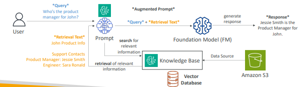
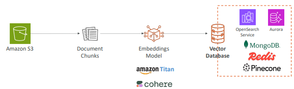
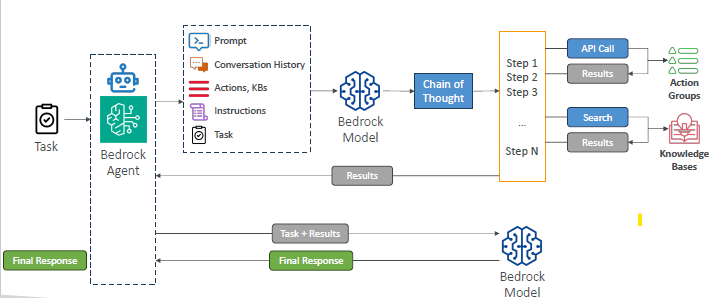
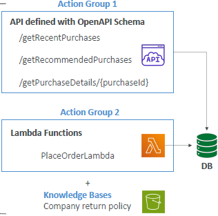
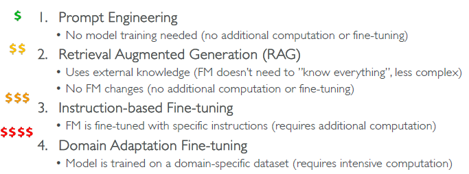

- [Amazon Bedrock Getting Started](https://skillbuilder.aws/learn/63KTRM86DQ/amazon-bedrock-getting-started/SC2Y3HMAUE)

## Intro
- interface to multiple foundation models, eg
    - [amazon.nova-premier-v1:0 ](https://us-east-2.console.aws.amazon.com/bedrock/home?region=us-east-2#/model-catalog/serverless/amazon.nova-premier-v1:0 )
    - [amazon.nova-micro-v1:0](https://us-east-2.console.aws.amazon.com/bedrock/home?region=us-east-2#/model-catalog/serverless/amazon.nova-micro-v1:0)
    - ...
    - amazon : **titan** , nova
    - meta: llama
    - Anthropic: claude
    - Mistral
    - **choose one** : by text,visual,multi, performance, token, level of customization, capabilties, pricing(by token),etc
- Build Generative AI (Gen-AI) applications on AWS
- Fully-managed service , don’t need to manage GPU infra, **use models via simple API calls** + `boto3`
- provides access to multiple FM from different providers ⬅️
- **Unified APIs**
- Buy **Provisioned throughput** for custom model 
    - reserve a certain capacity of compute 
    - requests for our Foundation Model (FMs) inference
    - guaranteeing performance and availability.
    - Instead of paying per request (on-demand), pre-allocate throughput capacity.
    - pay for the reserved throughput whether fully used or not
    - Helps avoid throttling and latency spikes.
  
---
## Model Lifecycle in Bedrock
- base model as a read-only template that AWS keeps stable
- When you customize it, AWS makes a copy for your account, like creating a fork of the model

| Phase                  | Description                                                                                    |
| ---------------------- | ---------------------------------------------------------------------------------------------- |
| **Base Model**         | Hosted by AWS (e.g., Titan, Claude, Jurassic, Mistral) — immutable and shared                  |
| **Fine-Tuned Version** | Your private copy with added training or instructions — only visible to you                    |
| **Inference Endpoint** | You call *your* version of the model via API; others don’t see or use it                       |
| **Billing**            | You’re billed for fine-tuning, storage, and inference time separately from the base model cost |


---
## 1. Customize/Optimized/Fine tune
- bedrock hosts the large foundation model, readOnly, and shared across customers.
   - makes a reference to the base model + delta layers(created with tuning) 
- Adapt a **copy of FM** with our own Training data ( formatted +  keep in S3)
- further trained on a particular field/domain by ML engineers
- it will eat up Provisioned throughput $$ while tuning/training.
- creates a lightweight, **private version** of the model without duplicating the global model (immutable/frozen) ⬅️
   - called adapters, LoRA layers, or delta weights
   - These new parameters plug into the base model at runtime

- **types**
```
Full                : Update all model weights (requires lots of compute)
Parameter-efficient : Update only small parts (like LoRA, adapters) to save cost and time
Prompt              : Learn soft prompts without changing model weights
```

- **strategies**
```
== Supervised Instruction Fine-Tuning ==
Labeled data :
[
  {
    "prompt": "How do you boil an egg?",
    "response": "Place the egg in boiling water for 9–12 minutes."
  }
]

== Domain Adaptation Fine-Tuning / continued pre-training ==
unlabeled domain-specific data :
need ML engineer
$$
[
  { "input": "Medical record of a patient with Type 2 diabetes..." }
]

== Conversation and single/Multi-Turn Messaging ==
To handle chat-style applications - Customer support bots, etc
{
  "system": "You are a helpful assistant.",
  "messages": [
    { "role": "user", "content": "What's the weather in LA?" },
    { "role": "assistant", "content": "It’s sunny and 75°F in Los Angeles today." },
    { "role": "user", "content": "What about tomorrow?" }
  ]
}
```

---
## 2. Evaluate Model
- evaluation metrics
- ways - manual or by another Model
- reference : benchmark
- compare model response with benchmark response
- explore more later ❓

---
## 3. RAG and KnowledgeBase
- real-time data is needed to be fed into the FM , **outside of its training data**
- Bedrock takes care of creating **Vector Embeddings** (dynamoDB, aurora, RDS, ElasticSearch, Neptune)
- **Source** : s3, saleforce, confluence, website, sharpoint, etc
- on console : knowledge base
- 
- 

---
## 4. guardrails
- Control the interaction between users and FM
- Filter undesirable and harmful content
- Remove PII
- Enhanced privacy
- Reduce hallucinations
- Ability to create multiple Guardrails and monitor and analyze user inputs that can violate the Guardrails

```
aws console:
  Provide guardrail details
    Configure content filters
    Add denied topics
    Add word filters
    Add sensitive information filters
    Add contextual grounding check
  Review and create
```

---
## 5. Agents
- [https://aistylist.awsplayer.com/](https://aistylist.awsplayer.com/)
- Agents are configured to perform **specific pre-defined action groups**
- perform tasks in the **correct order** and ensure information is **passed** correctly between tasks
- **Integrate** with other systems, services, databases, RAG and API to exchange data
- can trace/debug agent actions
- hands on (pending...)❓





---
## 6. CW integration
- Enable **model invocation logging** : s3 + CW
- create metrics
- check inbuilt metric

---
## 7. pricing

- **On-Demand** – great for unpredictable workloads, no long-term commitment
- **Batch** – provides up to `50% discounts`
- **Provisioned Throughput** – (usually) not a cost-saving measure, great to **reserve capacity**
- Temperature, Top K, Top P – no impact on pricing ⬅️
- **Model size** – usually a smaller model will be cheaper (varies based on providers)
- **Number of Input and Output Tokens** – main driver of cost



---
## Amazon Q
### Amazon Q business

### Amazon Q developer
- install IDE plugin, like github copilot

