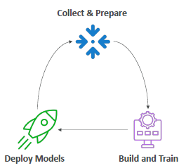
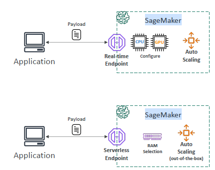
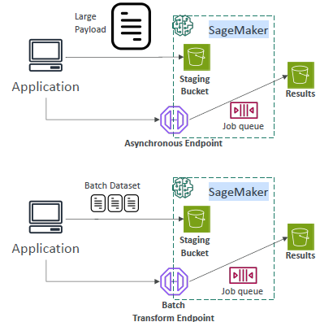

## Intro
- fully managed service
- build, train, tune, and deploy ML models at scale

  | **Phase**   | **Service Feature**                               |
  | ----------- | ------------------------------------------------- |
  | Data Prep   | SageMaker Data Wrangler, Ground Truth             |
  | Model Build | SageMaker Studio Notebooks, SageMaker JumpStart   |
  | Training    | Training Jobs (Script Mode, BYO Model)            |
  | Fine-tuning | SageMaker AMT (for foundation models)             |
  | Deployment  | Real-time, Batch, Async Inference                 |
  | Monitoring  | Model Monitor, Clarify (bias detection), Debugger |

## Algo
- SageMaker provides many pre-optimized, scalable algorithms, so you don't have to build from scratch.

| **Category**             | **Algorithm**                          | **Use Case**                    |
| ------------------------ | -------------------------------------- | ------------------------------- |
| Classification           | XGBoost, Linear Learner                | Binary, multiclass problems     |
| Regression               | XGBoost, KNN                           | Sales forecasting, predictions  |
| Clustering               | KMeans                                 | Customer segmentation           |
| NLP                      | BlazingText, Object2Vec                | Text classification, embeddings |
| Anomaly Detection        | Random Cut Forest (RCF)                | Fraud detection                 |
| Recommendation           | Factorization Machines                 | Product recommendations         |
| Image                    | Image Classification, Object Detection | Computer vision                 |
| Time Series              | DeepAR, Forecasting                    | Stock, weather prediction       |
| Dimensionality Reduction | PCA, ICA                               | Feature engineering             |

## AMT
- AMT is commonly used when fine-tuning LLMs or deep learning models.
- finds the best **hyperparameters** for model using Bayesian optimization.
- steps:
    - provider -> **Training script** +  Search space for hyperparameters (learning rate, batch size, etc.)
    - SageMaker runs multiple training jobs
    - Optimizes for a metric (e.g., validation accuracy)

## inference

| **Inference Type**       | **When to Use**                                 | **Description**                                |
| ------------------------ | ----------------------------------------------- | ---------------------------------------------- |
| **Real-time**            | Live APIs / chatbot / fraud detection           | Model deployed behind HTTPS endpoint           |
| **Batch Transform**      | Large datasets (offline)                        | Run predictions on S3 input data in bulk       |
| **Asynchronous**         | Long-running tasks (document processing, GenAI) | Async endpoint returns a job ID, results later |
| **Serverless Inference** | Spiky traffic, cost-sensitive                   | Deploy without provisioning instances          |
| **Multi-model Endpoint** | Multiple models behind one endpoint             | Efficient for hundreds of lightweight models   |

## Sage maker Studio
- SageMaker Studio is a **web-based IDE** for all ML tasks: data prep, training, tuning, deployment, monitoring.

| Feature                | Description                                |
| ---------------------- | ------------------------------------------ |
| **Notebooks**          | JupyterLab-style coding                    |
| **Data Wrangler**      | Visual data prep & feature engineering     |
| **Experiment Tracker** | Track training runs and performance        |
| **Model Monitor**      | Monitor drift, latency, accuracy           |
| **JumpStart**          | 1-click deployable models (including LLMs) |
| **Pipelines**          | MLOps automation with CI/CD for ML         |
| **Integration**        | Git, SageMaker Debugger, Ground Truth      |

- in progress ❓
