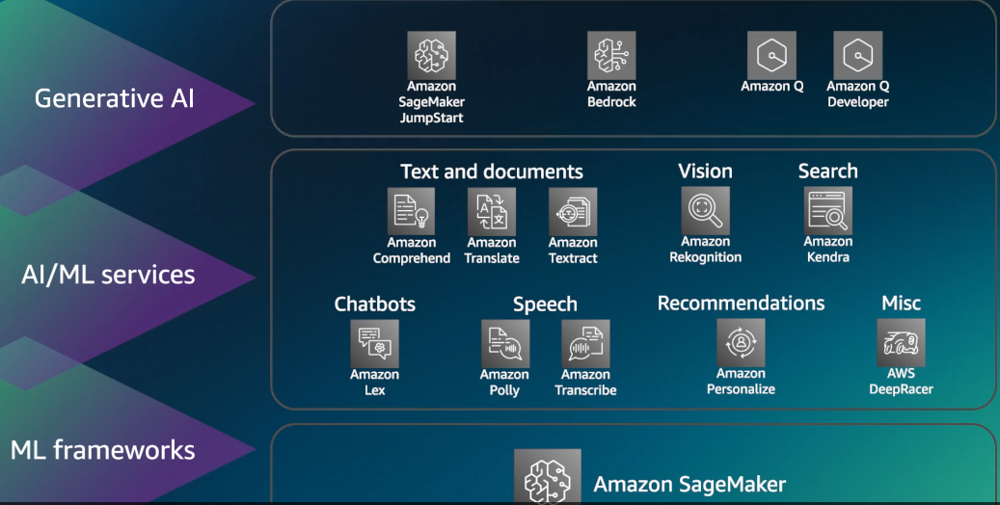

| **Service**                                | **Category**            | **Description**                                                                                                                | **Use Cases**                                         |
| ------------------------------------------ | ----------------------- | ------------------------------------------------------------------------------------------------------------------------------ | ----------------------------------------------------- |
| **Amazon SageMaker**                       | Machine Learning        | End-to-end ML platform to build, train, fine-tune, deploy custom ML models                                                     | ML lifecycle (train, tune, deploy), AutoML, notebooks |
| **Amazon Bedrock**                         | Generative AI           | Fully managed service to build and deploy GenAI apps using foundation models (FMs) from Anthropic, AI21, Mistral, Meta, Amazon | Chatbots, Text generation, Summarization, RAG         |
| **Amazon SageMaker JumpStart**             | ML / GenAI              | Pre-built models and solutions (including LLMs) for quick deployment                                                           | Start with models like Falcon, LLaMA, BERT            |
| **Amazon Comprehend**                      | AI / NLP                | Natural Language Processing (NLP) service to extract insights like entities, sentiment, topics                                 | Document classification, sentiment analysis           |
| **Amazon Rekognition**                     | AI / Vision             | Image and video analysis via APIs                                                                                              | Face detection, object recognition, safety checks     |
| **Amazon Textract**                        | AI / Vision + NLP       | Extracts text, forms, and tables from scanned documents                                                                        | Invoice processing, form data extraction              |
| **Amazon Polly**                           | AI / Speech             | Converts text to lifelike speech (text-to-speech)                                                                              | Voice assistants, accessibility tools                 |
| **Amazon Transcribe**                      | AI / Speech             | Converts speech to text (automatic speech recognition)                                                                         | Call center transcription, subtitles                  |
| **Amazon Translate**                       | AI / NLP                | Real-time or batch translation across multiple languages                                                                       | Multilingual apps, localization                       |
| **Amazon Lex**                             | AI / Conversational     | Build conversational interfaces (chatbots) using voice/text                                                                    | Customer support bots, voice assistants               |
| **Amazon Kendra**                          | AI / Search + NLP       | Intelligent search engine using ML for enterprise data                                                                         | Semantic search over internal documents               |
| **Amazon OpenSearch + ML Plugins**         | ML + Search             | Vector search with KNN, semantic search, anomaly detection                                                                     | RAG (Retrieval-Augmented GenAI), log analytics        |
| **AWS Lambda + Bedrock / SageMaker**       | Application Integration | Run inference logic, preprocessing/postprocessing in serverless functions                                                      | Lightweight GenAI backends                            |
| **AWS Step Functions**                     | Orchestration           | Workflow orchestration for ML/GenAI pipelines                                                                                  | Automate fine-tuning, prompt chaining, moderation     |
| **Amazon CloudWatch + SageMaker Debugger** | Monitoring              | Monitor ML training and inference workloads                                                                                    | Track performance, model drift, usage                 |
| **AWS Data Wrangler**                      | Data Prep               | Python library to simplify data preprocessing with Pandas + AWS services                                                       | Preprocessing for SageMaker                           |
| **AWS Glue**                               | ETL + ML                | Serverless data integration with ML transforms                                                                                 | Data prep before model training                       |
| **Amazon Forecast**                        | AI / Time Series        | Time series forecasting using ML                                                                                               | Demand forecasting, capacity planning                 |
| **Amazon Personalize**                     | AI / Recommendation     | Real-time personalization and recommendation service                                                                           | E-commerce, streaming platforms                       |
