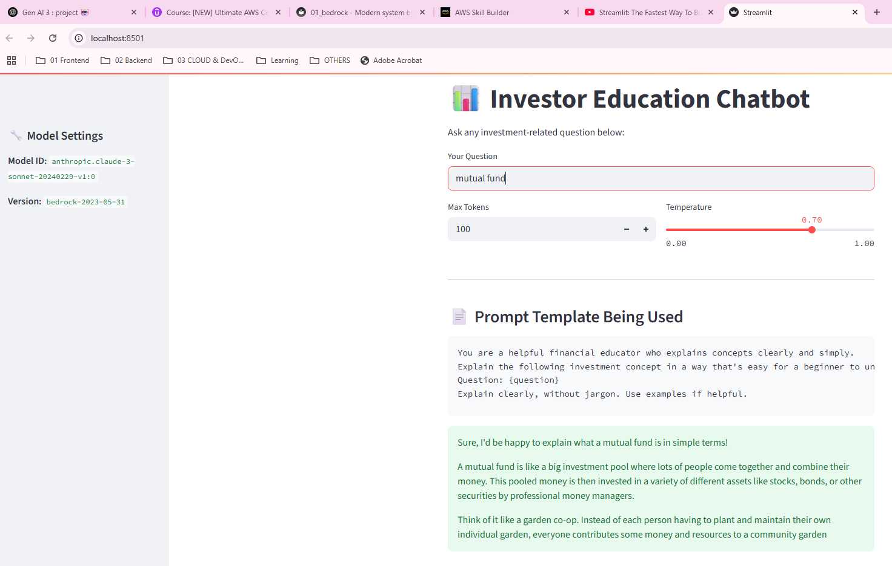

## Deployment
- https://share.streamlit.io/
- https://genai-lekhrajdinkar.streamlit.app 🟢

---
## POC/Project details
```
✅ Project Overview: Investor Education Chatbot

Goal:
    Allow users (clients or advisors) to ask investment-related 
    questions in natural language and get accurate, friendly explanations.
    educate clients on basic investment topics using LLM with American Funds tone.

Prompt: 
    “What is a target date fund?” or “How does dollar cost averaging work?”
    “What is dollar cost averaging?”
    “How do target date funds work?”
    “What is the difference between a mutual fund and ETF?”
    
Tech Stack:
    Bedrock Claude ✅
    Python + boto3 + streamlit + fastapi ✅
    Optionally fine-tuned FAQs from AmericanFunds.com ... pending 🔸

------------

C:\Users\lekhrajdinkar\Documents\GitHub\idea\02-etl-pyspark\
├── src\
│   └── poc_1\
│       ├── app.py                # FastAPI main app
│       ├── bedrock_client.py     # Handles AWS Bedrock calls
│       ├── prompt_template.py    # Prompt engineering
│       ├── utils.py              # Any helper functions
│       ├── ui_streamlit.py       # Optional: Streamlit frontend
│       └── topics\               # Optional: Static content for fallback
│           └── target_date_funds.md
├── requirements.txt
```

## FM Model :: anthropic.claude-3-sonnet
- https://us-east-1.console.aws.amazon.com/bedrock/home?region=us-east-1#/model-catalog/serverless/anthropic.claude-3-sonnet-20240229-v1:0
- https://us-east-1.console.aws.amazon.com/bedrock/home?region=us-east-1#/model-catalog/serverless/anthropic.claude-3-5-sonnet-20240620-v1:0
- https://us-east-1.console.aws.amazon.com/bedrock/home?region=us-east-1#/model-catalog/serverless/anthropic.claude-3-5-sonnet-20241022-v2:0


| Layer                | Tool                                 |
| -------------------- | ------------------------------------ |
| LLM                  | **AWS Bedrock** (Claude or Sonnet)   |
| App Backend          | **Python** + **FastAPI**             |
| LangChain (optional) | For prompt templates, memory         |
| UI                   | Streamlit or simple React (optional) |
| Logging / Metrics    | CloudWatch / local logs              |


---
## run project locally
- **API** :: uvicorn src.AIModule.poc_1.app:app --reload
- **UI**
    - streamlit run src/AIModule/poc_1/ui_streamlit.py
    - python -m src.AIModule.poc_1.ui_streamlit
    - public version :: [https://github.com/lekhrajdinkar/genai/blob/main/streamlit_app.py](https://github.com/lekhrajdinkar/genai/blob/main/streamlit_app.py)

## sample response
```json
{
  "id": "msg_bdrk_016q23K3gc9eVdBqmbEiiLqx",
  "type": "message",
  "role": "assistant",
  "model": "claude-3-sonnet-20240229",
  "content": [
    {
      "type": "text",
      "text": "Sure, Id be happy to explain what a mutual fund is in simple terms ........."
    }
  ],
  "stop_reason": "max_tokens",
  "stop_sequence": null,
  "usage": {
    "input_tokens": 70,
    "output_tokens": 400
  }
}
```

---
## Overview

