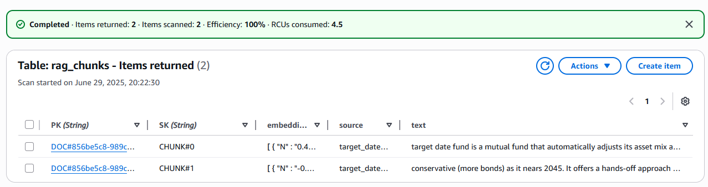

## Infra : s3, dynamo, IAM role
- [terraform workspace : genai-poc-2-rag](https://app.terraform.io/app/lekhrajdinkar-org/workspaces/genai-poc-2-rag)
- **terraform apply**
- [run HCP](https://app.terraform.io/app/lekhrajdinkar-org/genai-poc-2-rag/runs/run-TyiNbuDn4Veg3hrj)
    - [bedrock_rag_execution_role](https://us-east-1.console.aws.amazon.com/iam/home?region=us-east-1#/roles/details/bedrock_rag_execution_role?section=permissions) 
    - [genai-rag-demo-lekhrajdinkar-bucket](https://us-east-1.console.aws.amazon.com/s3/buckets/genai-rag-demo-lekhrajdinkar-bucket?region=us-east-1&bucketType=general)
    - [DynamoDB table - rag_chunks](https://us-east-1.console.aws.amazon.com/dynamodbv2/home?region=us-east-1#table?name=rag_chunks)
- **streamlit run .\src\AIModule\poc_2_rag\ui_streamlit.py** 🏃🏻‍♂️

## project structure
-  [reference chatgpt 🗨️](https://chatgpt.com/c/6861ffef-7224-800d-a81b-1fe26b66e9b4)
```
src/AIModule/poc_2_rag/
├── embedder.py           # Call Bedrock embedding model
├── rag_ingest.py         # Load files, chunk, embed, and store to DynamoDB/S3
├── dynamo_client.py      # DynamoDB helper for saving & querying
├── s3_client.py          # S3 file upload
├── utils.py              # Chunking, cleaning
└── sample_docs/          # Put PDFs or .md here
```

## Steps
```
🔸 Step 1 :: rag_ingest.py

✅ Load .md or .txt files (ensure proper MIME/type check)
✅ Chunking (handled via utils.py)
✅ Embedding (using embedder.py, Bedrock Titan model)
✅ Storage:
    S3: Upload full file using s3_client.py
    DynamoDB: Save chunks with metadata using dynamo_client.py

🔸 Step 2 :: infra setup  

1. IAM Role/User Permissions
    ✅ Bedrock full access (bedrock:* or specific InvokeModel)
    ✅ DynamoDB access:dynamodb:PutItem, GetItem, Query, BatchWriteItem
    ✅ S3 access:s3:PutObject, GetObject, ListBucket

2. DynamoDB Table: rag_chunks
    ✅ PK: doc_id (e.g., filename or UUID)
    ✅ SK: chunk_id (e.g., 0001, 0002, ...)
    ✅ Attributes:
            text (chunk content)
            embedding (vector array, stored as list of floats or base64)
            source (file name or S3 URI)
            metadata (optional: created_at, author, etc.)
            
3. S3 Bucket : genai-rag-demo-lekhrajdinkar-bucket
```

---
## Screenshot




