##  My Regular task list
- Coding
    - clean, simple, and modular code | **Practice regular code reviews**
    - Maintain **coding** standards + static code analysis tools (coverage + quality) + fix vulnerabilities
    - **Git** branch + Version control + CI/CD pipelines
- Automated unit **testing** (Junit, pytest) + Integration testing
- **Performance** optimization
- Adopt **cloud-native architecture patterns**, 
    - including microservices, 
    - containerization (e.g., Docker, Kubernetes),
    - serverless computing, which supports scalability and maintainability
- **system design and architecture**
    - trade-offs 
    - design patterns
    - scalability
    - reliability
    - performance | latency 
- **Monitor and log application behavior** 
    - actively to catch issues early in production
- continuously **improve** and **refactor** code

- **Collaboration**:
    - work closely with cross-functional teams (DevOps, QA, Product)
    - use Agile methodologies to enhance collaboration and adaptability
- **Documentation**:
    - maintain clear and up-to-date documentation (e.g., Swagger, OpenAPI)
- **Knowledge Sharing**:
    - conduct regular knowledge sharing sessions within the team
- **Continuous Learning**:
    - stay updated with the latest technologies and best practices
- **Feedback Loops**: 🔸
    - implement feedback loops to gather insights from users and stakeholders

## ✔️Prioritize **security** from the start 
- **shift security left** in the SDLC
    - integrate security practices into the development process

- **AWS** 
    - ACM for TLS certificates
    - TLS certificates | mTLS | PKCS#12, pem, crt, key files, openSSL
    - certificate Rotation | `Nomos` -internal tool for certificate management
    - AWS Secrets Manager | HashiCorp Vault + CyberArk vault
    - AWS organization root account
    - permission boundaries
    - Cross account access
- AWS :: VPC
  - Firewalls and network security groups 
  - R53 routing policies
- Delegated authentication and authorization
    - OAuth2.0, OpenID Connect, JWT tokens
    - grant type: AF, CC, AF+pkcs 
    - 1-1 or 1-M
    - providers : AWS Cognito, Okta
- **LDAP** 
    - role-based access control (RBAC)
    - ACLs, 
    - Resource-based access control (RBAC)
    - SAML / SSO
- **kubernetes security**
    - Network policies, 
    - pod security policies, 
    - role-based access control (RBAC)
    - Service mesh (e.g., Istio) for secure service-to-service communication

- organisation level
    - **Conduct regular security audits** 
    - chain-gaurd images
    - CI pipeline: 
        - Snyk, Wiz, SonarQube
        - SAST, DAST
- **Collaborate** 
    - with security teams to ensure compliance with security standards and best practices
    - **Train developers** on secure coding standards 
    - and expect them to **write code with security in mind**

## ✔️Mindset
- DevSecOps
- gitOps
- Shift security left in the SDLC
- Leverage CI/CD pipelines
- infrastructure as code (IaC)
- Observability as Code (OaC)
- Everything as Code (XaaC)
- **Automation** : repetitive tasks

## ✔️Embrace Agile methodologies
- to improve **team collaboration** 
- and **adaptability to changing requirements**
- [02_agile.md](02_agile.md) 👈🏻

## ✔️Use Right tools
- IDEs: IntelliJ, VSCode, PyCharm, Eclipse
- **APIs**: REST, GraphQL, gRPC
- **Cloud Platforms**: AWS, Azure, GCP
- **Infrastructure as Code**: Terraform, AWS CDK, CloudFormation
- **Version Control**: Git, GitHub, GitLab
- **CI/CD**: harness, GitHub Actions, CircleCI
- **Containerization**: Docker, Kubernetes, Helm, 
- **Monitoring**: Datadog, splunk, Prometheus, Grafana, ELK Stack
- **Testing**: JUnit, pytest, Selenium, Postman
- **Documentation**: Swagger, OpenAPI, MkDocs
- **Static Analysis**: SonarQube, ESLint, Pylint
- **Security**: Snyk, wiz

## ✔️languages, frameworks, and databases
- **Languages**: Java, Python, JavaScript, TypeScript, Go, C#, Ruby, Rust
- **Frameworks**: Spring Boot, Django, Flask, React, Angular
- **Databases**: PostgreSQL, dynamoDB, Redis, Cassandra

## 🤖AI-powered development tools 
- improves productivity + code quality 
- Agentic AI tools + build own agents
- AI-assisted code reviews
- AI-driven testing frameworks
- AI-based monitoring and observability tools
- AI-powered documentation generation
- AI-assisted debugging tools
- AI-driven code refactoring tools
- AI-based performance optimization tools
- AI-powered security scanning tools
- AI-assisted knowledge management systems
- AI-driven incident response tools
- AI-powered project management tools
- AI-assisted requirement analysis tools
- AI-driven user experience design tools
- AI-powered code generation tools
- AI-assisted code completion tools
- AI-driven code search and navigation tools

---
## SDLC Principles & Trends - 2025
- This mind map captures the core principles, popular models, key trends, and best practices in Software Development Life Cycle (SDLC) as of 2025.

```mermaid
mindmap
  root((SDLC Principles & Trends - 2025))

    A. Core_Phases 🔰
      Planning 🔸
        Requirements_Gathering
        Feasibility_Study
      Analysis 🔸
        Stakeholder_Interviews
        Requirements_Specification
      Design 🔸
        High-Level_Design
        Low-Level_Design
        UI/UX_Design
      Implementation 🔸
        Coding
        Version_Control
        Code_Reviews
      Testing 🔸
        Unit_Testing
        Integration_Testing
        System_Testing
        Acceptance_Testing
      Deployment 🔸
        Release_Strategies
        Rollback_Plans
      Maintenance 🔸
        Bug_Fixes
        Enhancements
        Monitoring

    B. Popular_Models 🔰
      Waterfall
      V-Model
      Iterative
      Agile
        Scrum
        Kanban
        Lean
        XP
        DevOps
        Scrumban
      Spiral
      Big_Bang

    C. Key_Trends_&_Changes 🔰
      Agile_Dominance 🔸
        Agile_Manifesto
        Continuous_Feedback
      DevOps_Integration 🔸
        CI/CD_Pipelines
        Automation
        Infrastructure_as_Code
      Cloud-Native_Software 🔸
        Microservices
        Serverless
        Containerization
        Cloud_Deployment
      Security_Shift_Left 🔸
        DevSecOps
        Early_Security_Testing
      Compliance_and_Privacy 🔸
        GDPR
        SOC2
        ISO_27001
      AI/ML_Integration 🔸
        Automated_Testing
        Analytics
      Remote_Teams 🔸
        Async_Development
        Collaboration_Tools

    D. Best_Practices 🔰
      Continuous_Learning
      Automation_Testing
      Regular_Code_Reviews
      Shift_Left_Testing
      Monitoring_and_Logging
      Feedback_Loops
      Documentation
      Cross-Functional_Collaboration
      Emphasis_on_User_Experience
      Security_by_Design

    E. Useful_References 🔰
      Agile_Alliance
      DevOps_Handbook
      OWASP
      Cloud_Architectures
      State_of_DevOps_Report

```
