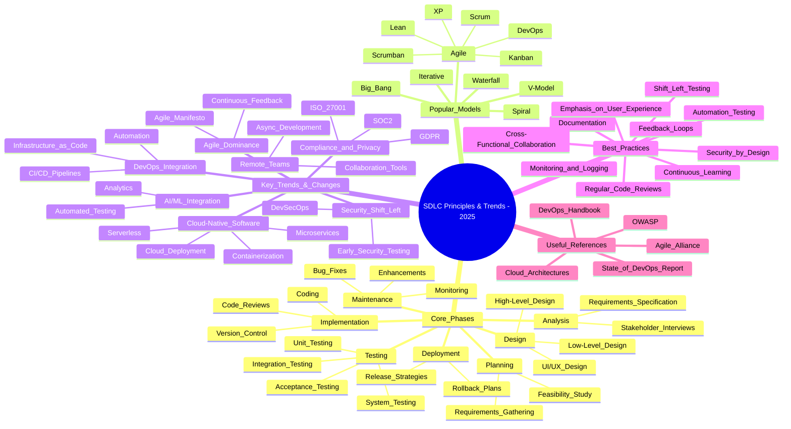

## 1. Summary \& Categorization

### **A. Technical Expertise**

- Programming: Python, C\#, scripting (at least one language)
- Cloud: AWS (proficiency), familiarity with cloud concepts
- Tools/Platforms: Github, DataBricks, Terraform, APIs, SQL
- Practices: Software engineering best practices (unit testing, code reviews, design documentation)
- Solution Design: Architecting, designing, and implementing scalable, robust solutions
- Emerging Tech: Strong grasp of new/emerging technology patterns \& frameworks


### **B. Solution Delivery \& SDLC**

- Full lifecycle: Analysis, development, testing, deployment, support
- End-to-end solutioning across SDLC phases
- Quality: Standards for simplicity, test coverage, documentation


### **C. Stakeholder Collaboration \& Communication**

- Relationship-building: With customers, business stakeholders, IT, GBS, vendors
- Requirements elicitation: From customers and partners
- Teamwork: Collaboration across Agile teams, architecture, global technology teams
- Communication: Strong verbal, written, and presentation skills


### **D. Leadership \& Influence**

- Technical guidance: Leading teams, providing direction, mentorship
- Thought leadership: Deep understanding of business capabilities, influencing roadmaps
- Business acumen: Understand and clearly define business problems, influence solutions
- Vendor management: Technical oversight and integration of external solutions


## 2. Mind Map (Text-Based)

```
Solutions Engineer III
│
├── Technical Expertise
│   ├─ Programming: Python, C#, Scripting
│   ├─ Cloud: AWS, general concepts
│   ├─ Tools: Github, DataBricks, Terraform
│   ├─ APIs, SQL
│   ├─ Tech Patterns & Frameworks
│   └─ Engineering Best Practices
│
├── Solution Delivery & SDLC
│   ├─ Requirements Analysis
│   ├─ Design & Architecture
│   ├─ Development & Implementation
│   ├─ Testing & Quality Assurance
│   ├─ Deployment & Support
│   └─ Documentation & Code Reviews
│
├── Stakeholder Collaboration
│   ├─ Customers
│   ├─ Business Stakeholders
│   ├─ ITG, GBS
│   ├─ Architecture Teams
│   ├─ Vendors
│   └─ Agile Teams
│
├── Leadership & Influence
│   ├─ Technical Guidance
│   ├─ Business Acumen
│   ├─ Thought Leadership
│   └─ Vendor Management
│
└── Communication
    ├─ Relationship Building
    ├─ Networking
    ├─ Presentation Skills
    └─ Clear Documentation
```



---
## 3. Prepare for the Interview ✅

### **Technical Focus**

- Brush up on core programming (esp. Python, C\#)
- Deepen AWS and Terraform knowledge
- Practice writing/consuming APIs, working with SQL and DataBricks
- Review architecture/design patterns and best practices


### **SDLC/Process Focus**

- Be ready to discuss end-to-end solution design (examples from concept to deployment/support)
- Know Agile processes and cross-team collaboration techniques
- Prepare examples of upholding quality (tests, code reviews, docs)


### **Stakeholder \& Leadership Skills**

- Prepare specific anecdotes on requirement elicitation \& stakeholder management
- Think about examples where you led technical direction or mentored others
- Be ready to discuss experiences influencing product/technology roadmaps


### **Business \& Communication Skills**

- Have clear, relevant examples of communicating complex tech concepts to non-technical audiences
- Prepare a “business problem to technical solution” story
- Be ready to speak about vendor/partner integration and management

Let me know if you’d like possible interview questions or flashcards for preparation!

