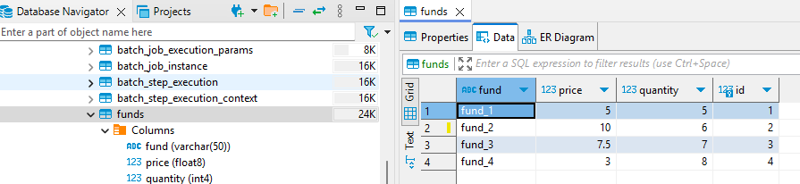

- [Notes](docs)
- https://chat.deepseek.com/a/chat/s/6ac524e6-d406-4a1a-a56a-858caa75275a
---
# project Structure
- **run**
  - database : [docker-compose-postgres.yml](docker-compose-postgres.yml)
  - [app_run.bat](app_run.bat) | [app_run.sh](app_run.sh)
  - [Dockerfile](Dockerfile)
- **lsof -i :8000** : list all processes that are currently using port 8000
- **fastapi** : http://127.0.0.1:8000/run_etl
- **sqlachely** : session, engine, session.all/add_all( entities), s.commit()
- swagger **doc** : http://localhost:8000/docs :point_left:
- project configs:
  - etl config: [config](config)
  - env config: [env](env)
  - json file --> json.load() --> **dictionary**
```
curl -X 'POST' \
  'http://localhost:8000/run_etl/' \
  -H 'accept: application/json' \
  -H 'Content-Type: application/json' \
  -d '{  "etl_name": "etl-2" }'

```
- update path, here [env](env)
```
  "input_path": "C:\\Users\\Manisha\\Documents\\GitHub\\02-etl-pyspark\\DIR_SOURCE\\etl-1-source.csv",
  "output_path": "C:\\Users\\Manisha\\Documents\\GitHub\\02-etl-pyspark\\DIR_SOURCE\\etl-1-target",
```
```
02-etl-pyspark/
│
├── Notes
├── DIR_SOURCE
│   ├── etl-1-source.csv
│   ├── etl-2-source.csv
│   ├── ...
├── DIR_TARGET
├── config/
│   ├── etl-1.json
│   └── etl-2.json
│   └── ...
├── src/
│   ├── module1
│   ├── module2
│   ├── ...
│   ├── etlModule
│   │   ├── validator.py
│   │   ├── formatter.py
│   │   ├── transformer.py
│   │   └── __init__.py
│   ├── main.py
└── requirements.txt
└── Dockerfile
└── app_run.sh
```
- DIR_SOURCE: The source data directory containing CSV files for ETL processing.
- DIR_TARGET: Target directory where transformed data will be stored (not listed with specific files, but inferred from the structure).
- config: Contains configuration files (likely JSON), such as etl-1.json, which could define processing rules or mappings for different ETL steps.
- **src**: The main source code directory.
  - module1
  - module2, 
  - ...
  - Different functional modules or libraries.
  - **etlModule**: The core ETL logic, including:
    - **validator**: Handles data validation.
    - **formatter**: Manages data formatting.
    - **transformer**: Contains transformation logic for the ETL process.
  - `main.py`: The main entry point for running the ETL process.
- requirements.txt: Python dependencies needed for the project.
- Dockerfile: Used to containerize the application, likely for deployment or running in different environments.
- `app_run.sh`: A shell script to automate the execution of the application.
- result



---
## Spark History Server
- may be need to need ENV VAR again :point_left:
- Spark UI becomes unavailable after the Spark session stops because it is tied to the lifecycle of the session
- persist the Spark application event data and access it later for debugging or analysis.
- Configure Spark to log events to a director or s3:
```
# spark-defaults.conf

spark.eventLog.enabled true

spark.eventLog.dir hdfs://<path-to-hdfs> (or a local directory)

spark.eventLog.dir s3://your-bucket-name/spark-logs/
spark.hadoop.fs.s3a.access.key YOUR_ACCESS_KEY
spark.hadoop.fs.s3a.secret.key YOUR_SECRET_KEY
spark.hadoop.fs.s3a.impl org.apache.hadoop.fs.s3a.S3AFileSystem
```
- start: **./sbin/start-history-server.sh**
  - spark.history.fs.logDirectory <above-path>
  - http://<hostname>:18080