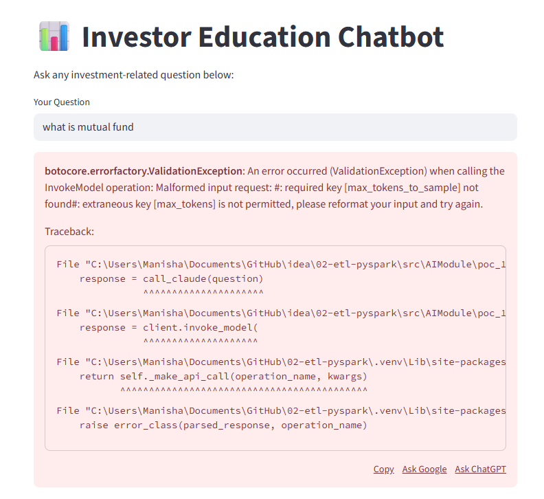

- https://share.streamlit.io/
- https://genai-poc-lekhrajdinkar.streamlit.app/

---
## Overview


---
## Project details
```
✅ Project Overview: Investor Education Chatbot

Goal:
    Allow users (clients or advisors) to ask investment-related 
    questions in natural language and get accurate, friendly explanations.
    educate clients on basic investment topics using LLM with American Funds tone.

Prompt: 
    “What is a target date fund?” or “How does dollar cost averaging work?”
    “What is dollar cost averaging?”
    “How do target date funds work?”
    “What is the difference between a mutual fund and ETF?”
    
Tech Stack:
    Bedrock Claude
    Python + LangChain
    Optionally fine-tuned FAQs from AmericanFunds.com

Bonus: 
    Add quiz feature using multiple-choice generation.


C:\Users\Manisha\Documents\GitHub\idea\02-etl-pyspark\
├── src\
│   └── poc_1\
│       ├── app.py                # FastAPI main app
│       ├── bedrock_client.py     # Handles AWS Bedrock calls
│       ├── prompt_template.py    # Prompt engineering
│       ├── utils.py              # Any helper functions
│       ├── ui_streamlit.py       # Optional: Streamlit frontend
│       └── topics\               # Optional: Static content for fallback
│           └── target_date_funds.md
├── requirements.txt
```

## Model :: anthropic.claude-3-sonnet
- https://us-east-1.console.aws.amazon.com/bedrock/home?region=us-east-1#/model-catalog/serverless/anthropic.claude-3-sonnet-20240229-v1:0
- https://us-east-1.console.aws.amazon.com/bedrock/home?region=us-east-1#/model-catalog/serverless/anthropic.claude-3-5-sonnet-20240620-v1:0
- https://us-east-1.console.aws.amazon.com/bedrock/home?region=us-east-1#/model-catalog/serverless/anthropic.claude-3-5-sonnet-20241022-v2:0


| Layer                | Tool                                 |
| -------------------- | ------------------------------------ |
| LLM                  | **AWS Bedrock** (Claude or Sonnet)   |
| App Backend          | **Python** + **FastAPI**             |
| LangChain (optional) | For prompt templates, memory         |
| UI                   | Streamlit or simple React (optional) |
| Logging / Metrics    | CloudWatch / local logs              |


---
## run project 
- **API** :: uvicorn src.AIModule.poc_1.app:app --reload
- **UI** 
    - streamlit run src/AIModule/poc_1/ui_streamlit.py
    - python -m src.AIModule.poc_1.ui_streamlit

## screenshot



## sample response
```json
{
  "id": "msg_bdrk_016q23K3gc9eVdBqmbEiiLqx",
  "type": "message",
  "role": "assistant",
  "model": "claude-3-sonnet-20240229",
  "content": [
    {
      "type": "text",
      "text": "Sure, Id be happy to explain what a mutual fund is in simple terms.
      \\n\\nA mutual fund is like a basket that holds different types of investments 
      like stocks, bonds, or other securities. When you invest in a mutual fund, 
      your money is pooled together with money from other investors. 
      This combined money is then used to buy a variety of investments that are managed 
      by professional fund managers.\\n\\nThink of it like a potluck dinner. 
      Instead of each person bringing their own dish, everyone contributes money to a common pot. 
      The fund managers then use that money to buy different \\dishes\\ (investments) 
      and create a diverse menu (portfolio) for everyone to share.\\n\\nThe key advantage of 
      a mutual fund is that it provides instant diversification. Instead of putting all your money 
      into just one or two investments, your money is spread across many different investments. 
      This helps reduce risk because if one investment performs poorly, the others may still do well, 
      balancing out the overall performance.\\n\\nAnother benefit is that mutual funds are managed 
      by professionals who research and monitor the investments within the fund. 
      This can be particularly helpful for individual investors who may not have the time or
       expertise to actively manage their own portfolios.\\n\\nThere are many different types of mutual funds, 
       such as those that invest in stocks (equity funds), bonds (fixed-income funds), 
       or a combination of both (balanced funds). There are also funds that focus on specific sectors, 
       like technology or healthcare, or specific investment styles, like growth or value investing.
       \\n\\nThe value of your investment in a mutual fund is determined by the performance of the underlying
        investments within the fund. If the fund\'s investments increase in value, the value of your shares
         in the fund will also increase. Conversely, if the investments decrease in value, 
         the value of your shares will decrease as well.\\n\\nDoes this help explain what a mutual fund 
         is and how it works? Let me know if you have any other questions!",
    }
  ],
  "stop_reason": "max_tokens",
  "stop_sequence": null,
  "usage": {
    "input_tokens": 70,
    "output_tokens": 400
  }
}
```
